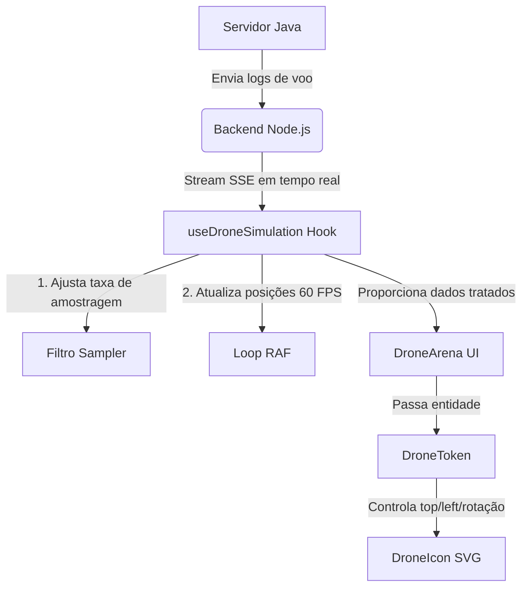

# 🚁 Arquitetura do Simulador de Drones

Este diretório contém a interface visual e lógica da simulação de drones em tempo real. O sistema utiliza uma arquitetura modular baseada em responsabilidades bem definidas, separando a lógica de negócios da renderização visual.

---

## 📁 Estrutura de Arquivos

```
frontend/src/components/simulator/
├── README.md               # Esta documentação
├── DroneArena.tsx          # Componente principal de apresentação (UI)
├── DroneArena.css          # Animações de hélices, LEDs e galpões (CSS Keyframes)
├── DroneToken.tsx          # Entidade física e posicionamento espacial do drone
├── DroneIcon.tsx           # Geometria em SVG do quadricóptero e pacote de carga
└── useDroneSimulation.ts   # Estado, conexão SSE e loop de física (React Hook)
```

---

## ⚙️ Papel de Cada Módulo

### 1. `useDroneSimulation.ts` (O "Coração" do Simulador)
É um hook customizado que gerencia toda a máquina de estados da simulação:
- **Conexão SSE (Server-Sent Events):** Abre uma conexão de streaming contínuo com a API Node.js para escutar eventos em tempo real (`drone_depart`, `drone_arrive`, `package_drop`, etc.).
- **Amostragem Adaptativa (Dynamic Sampler):** Avalia a cada 1 segundo o fluxo de requisições. Se a taxa de eventos for muito alta, ele ajusta um divisor matemático (`divisor = max(1, Math.round(rate / 5))`) para evitar o afogamento do navegador, mantendo o painel numérico 100% fiel à realidade da simulação do backend.
- **Ticking via requestAnimationFrame (RAF):** Atualiza a posição dos drones suavemente a 60 FPS com base na variação de tempo real (*delta time*), evitando saltos (*stuttering*).

### 2. `DroneArena.tsx` (A Apresentação Geral)
Responsável estritamente pela estrutura visual e renderização estática:
- Renderiza o grid de fundo e as linhas divisórias.
- Desenha os galpões de origem (Galpão A) e destino (Galpão B).
- Renderiza a barra de status de conexão e métricas gerais (taxa por segundo, entregas concluídas, quedas).
- Mapeia o vetor de drones ativos fornecido pelo hook e delega para o `DroneToken`.

### 3. `DroneToken.tsx` (Física Visual e Posicionamento)
Controla as variáveis espaciais do drone dentro da arena:
- **Cálculo Horizontal (`left`):** Interpola linearmente a posição horizontal de acordo com o `progress` de voo (da esquerda para direita na ida, e direita para a esquerda na volta).
- **Cálculo Vertical (`top`):** Distribui os drones de forma harmônica entre **4 pistas paralelas**. Para a ida (`10%` a `40%` da altura) e para o retorno (`60%` a `90%` da altura).
- **Simulação de Balanço (*Bobbing*):** Adiciona uma oscilação senoidal suave para simular a flutuação do vento no drone em voo.
- **Física da Queda (*Crash*):** Em caso de colisão, move o drone verticalmente em direção ao solo seguindo uma velocidade de aceleração de queda de 900ms.

### 4. `DroneIcon.tsx` (Representação Vetorial - SVG)
Renderiza a forma do drone em formato SVG escalável (fixado em `26px` para evitar colisões visuais de pistas paralelas):
- Desenha o chassi, motores e hélices.
- Controla dinamicamente a presença da carga (caixa amarela) se o drone estiver em rota de ida (`forward`).
- Define as classes de velocidade das hélices (ida rápida, retorno normal, crash estático).
- Renderiza os LEDs piscantes de segurança nas extremidades (Verde/Esquerda e Vermelho/Direita).

### 5. `DroneArena.css` (Animações de Hardware)
Contém as diretrizes CSS de animações aceleradas por hardware:
- `@keyframes` de rotação das hélices.
- `@keyframes` de piscar dos LEDs (padrão normal de navegação e piscada rápida em vermelho durante o crash).
- Efeito de pulsação e respiração (*breathe*) nas luzes dos galpões quando ativos.

---

## 🔄 Fluxo de Dados e Interações



## 📏 Pistas e Espaçamentos de Segurança

Para evitar sobreposição lateral (*overlapping*) de drones que voam paralelamente na mesma faixa de tempo, a arena utiliza as seguintes dimensões:
* **Espaço da Pista de Ida:** De `10%` a `40%` do topo da arena (90px de amplitude).
* **Espaço da Pista de Volta:** De `60%` a `90%` do topo da arena (90px de amplitude).
* **Quantidade de Pistas:** 4 pistas em cada sentido.
* **Tamanho do Drone:** 26px x 26px.
* **Margem de Segurança:** 30px verticais de centro a centro por pista, garantindo **colisão visual zero** mesmo com drones lado a lado.
